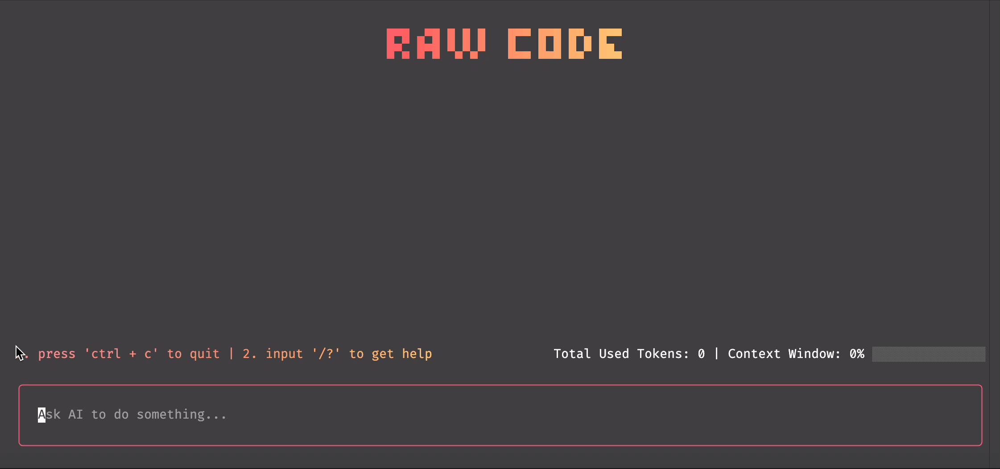

# Raw Code

A terminal-based AI coding agent built with TypeScript, React, and the AI SDK. This agent leverages large language models to assist with file operations and system tasks through an interactive command-line interface.



## Quick Start

```bash
# Your API key for Zhipu
export ZHIPU_APIKEY=your_api_key_here

npx shervinchen/raw-code
```

Once running:

1. Type your request or question
2. The agent will use available tools as needed
3. Approve or reject tool executions when prompted
4. View results in real-time with markdown formatting

## Tech Stack

- **Runtime**: Node.js with TypeScript
- **AI/ML**: AI SDK, OpenAI, Ollama
- **UI**: Ink (React for CLI), Ink UI components
- **State Management**: valtio
- **Utilities**: zod (validation), dedent, marked (markdown)
- **Tooling**: pnpm, biome, lefthook

## License

MIT
